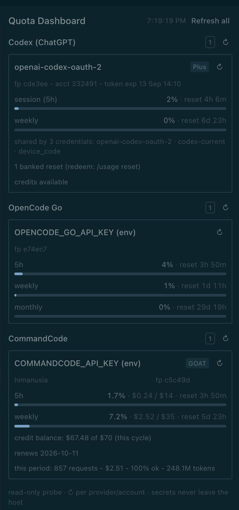

# Hermes Provider Quota Dashboard

**A [Hermes Desktop](https://hermes-agent.nousresearch.com/docs/developer-guide/desktop-plugin-sdk) plugin**
(`himanusia/hermes-provider-quota-dashboard`) that puts a live quota dashboard in
a side pane: subscription limits for **OpenAI Codex**, **OpenCode Go**, and
**CommandCode** — for *every* account in your Hermes credential pools, not just
the one currently selected.

Built with the Hermes Desktop Plugin SDK (`@hermes/plugin-sdk`) — plain ESM, no
build step. Drop it in the desktop plugin door and the app hot-loads it.



*The pane in a live Hermes Desktop session — the Codex card folds the pool's
credentials that share one account into a single readout, next to OpenCode Go
and CommandCode, each with its own refresh. (Account email redacted in this
screenshot.)*

## What it shows

| Provider | Per-account readout |
|---|---|
| **OpenAI Codex** | every pool credential: plan, 5h session + weekly windows (% used, reset time), banked resets, credit balance, token expiry, and short credential/account fingerprints. Credentials that resolve to the same account share one quota, so they collapse into a single card listing the credentials behind it |
| **OpenCode Go** | rolling (5h) / weekly / monthly usage % of each window's cap, with reset times |
| **CommandCode** | plan (GOAT / Pro / Max / Go / Teams), 5h and weekly windows ($ used / cap), monthly credit balance, renewal date, and the current billing period's request/token totals |

Ways to open it: a **status-bar chip** that follows the FOCUSED chat — it reads
the focused session's live provider/model (the same `model.options` read the
composer menu uses) and shows that provider's 5h usage (e.g. `OpenCode Go 5h 6%`;
a Codex-backed chat shows `Codex session (5h) 0%`) — and toggles the pane open /
closed (highlighted while the pane is open); a
**Quota Dashboard** row in
the left sidebar (opens the full-page view), and ⌘K palette commands:
**Quota: refresh dashboard**, **Quota: open in main workspace**,
**Quota: open as page**, **Quota: hide pane**, **Quota: show pane**.

Refresh at three granularities: **Refresh all** in the pane header, a **↻ button
per provider**, and a **↻ button on every account card**. A per-provider or
per-account refresh only re-probes that slice (`probe.py --provider <id>` /
`probe.py --account <provider>:<fp>`), then merges the fresh numbers into the
view — so you can re-check one Codex key without re-hitting the others. On a
merged account card (several credentials sharing one account), ↻ re-probes
every credential behind it.

## Install

Requires [Hermes Desktop](https://github.com/NousResearch/hermes-agent) with
the desktop plugin door (`~/.hermes/desktop-plugins/`).

```bash
git clone https://github.com/himanusia/hermes-provider-quota-dashboard.git
cd hermes-provider-quota-dashboard
./install.sh
```

`install.sh` copies `plugin.js` + `probe.py` into
`~/.hermes/desktop-plugins/quota-dash/`. The app watches that folder and loads
the plugin within seconds; if the pane does not appear, run
**⌘K → Reload desktop plugins**. The pane (`quotas`) docks into the right
panel — drag it wherever you like afterwards.

Manual install is the same two files:

```bash
mkdir -p ~/.hermes/desktop-plugins/quota-dash
cp plugin.js probe.py ~/.hermes/desktop-plugins/quota-dash/
```

Verify the probe standalone (uses the Hermes venv Python):

```bash
~/.hermes/hermes-agent/venv/bin/python \
  ~/.hermes/desktop-plugins/quota-dash/probe.py
```

## How it works

```
plugin.js (desktop pane)
   └─ host.request('shell.exec')            ← gateway JSON-RPC
        └─ probe.py  (backend host)         ← read-only probe
             ├─ Hermes credential pool      (agent.credential_pool)
             ├─ ~/.hermes/.env fallbacks
             └─ provider usage APIs         → @@QUOTA@@ {json}
```

`probe.py` enumerates every credential for each provider (pool rows first,
then `.env` fallbacks), probes the provider APIs in parallel, and prints a
single `@@QUOTA@@ {json}` line. `plugin.js` fetches that line through the
gateway's `shell.exec` RPC, parses it, and renders the bars — refreshed every
60 s and on demand.

### Data endpoints

| Provider | Endpoint | Credential |
|---|---|---|
| Codex | `chatgpt.com/backend-api/wham/usage` (or `/api/codex/usage`) | ChatGPT OAuth token per pool entry |
| OpenCode Go | `https://opencode.ai/zen/go/v1/usage` | `OPENCODE_GO_API_KEY` |
| CommandCode | `https://api.commandcode.ai/alpha/{whoami,billing/credits,billing/subscriptions,usage/summary}` | `COMMANDCODE_API_KEY` |

## Adding another provider

Pull requests adding providers are welcome — the seam is one function.

1. Write `probe_<id>(account) -> row` in `probe.py` next to the others.
   `account` is `{"label", "token", "base", "fp"}` (pool rows first, `.env`
   fallbacks second); return the row contract below.
2. Append one entry to `PROVIDERS` (id, display name, env-var fallback,
   default base URL, your probe function).
3. Test standalone: `python3 probe.py --provider <id>` — expect a single
   `@@QUOTA@@ {json}` line containing your provider's rows.

Row contract (only `label` is required; `normalize_row` fills the rest):

```python
{
  "label": "credential label",            # card title
  "sub":   "fp a1b2c3 - extra detail",    # muted detail line
  "plan":  "Plus",                        # badge, or None
  "acct":  "a1b2c3",                      # account-id hash — rows with the
                                          #   same value merge into one card
  "windows": [                            # one labelled bar each
    {"k": "5h", "pct": 42.0, "reset": "2026-09-12T23:26+07:00", "note": "$2 / $14"}
  ],
  "notes": ["any extra fact"],            # small muted lines
  "error": None                           # string -> warning line
}
```

The desktop pane renders whatever the probe returns — no UI changes needed.

Rules: probes are read-only (never refresh tokens, never mutate the pool,
never redeem credits), never print secrets (short SHA-256 fingerprints only),
one row per credential — the UI collapses rows that share an `acct`.

## Security & safety

- **Read-only by design.** The probe never refreshes tokens, never mutates
  credential pools, never redeems reset credits, and never re-authenticates.
  An expired token shows an `HTTP 401` hint instead of a silent refresh.
- **Secrets never leave the host.** The pane receives numbers, account
  handles, and short SHA-256 fingerprints only — no tokens, no full account
  ids, no email addresses (an email-only account shows a masked fallback).
- **No credentials in this repo.** Keys are read at runtime from the Hermes
  credential pool / `~/.hermes/.env` on your machine.

## Status

End-to-end verified **2026-09-12** on macOS (Hermes Desktop, local backend):
every Codex pool entry, OpenCode Go's windows, and CommandCode's GOAT plan all
returned and rendered in the pane. It is a dated check, not a permanent claim —
re-verify anytime with the standalone probe above.

## Limitations

- Codex access tokens expire; this tool reports the 401 rather than refreshing
  (use the account, or re-auth, then refresh the pane).
- CommandCode support uses the same `/alpha/…` endpoints its own CLI uses for
  `/usage` — undocumented, and may change without notice.
- OpenCode Go percentages are the provider's own usage % of each window cap
  (5-hour = 20% of the monthly limit, weekly = 50%; see opencode.ai/docs/go).
  Numbers are shown exactly as returned; nothing is recomputed locally.
- The status-bar chip derives its provider from the session's model slug:
  provider-prefixed slugs (`opencode-go/…`) resolve exactly; bare slugs use a
  small keyword table (`deepseek/kimi/qwen/glm/… → OpenCode Go`,
  `luna/sol/terra/gpt-5… → Codex`, `…goat… → CommandCode`). Unmapped models
  fall back to the tightest 5h window across all providers — the provider tag
  still shows which one.
- The pane needs the backend host to have the Hermes venv
  (`~/.hermes/hermes-agent/venv`) and `~/.hermes/.env` in the usual place.
  Set `HERMES_PYTHON` / `HERMES_QUOTA_PROBE` / `HERMES_HOME` in the backend
  environment (or edit `PROBE_CMD` in `plugin.js`) if your install differs.

## License

MIT
